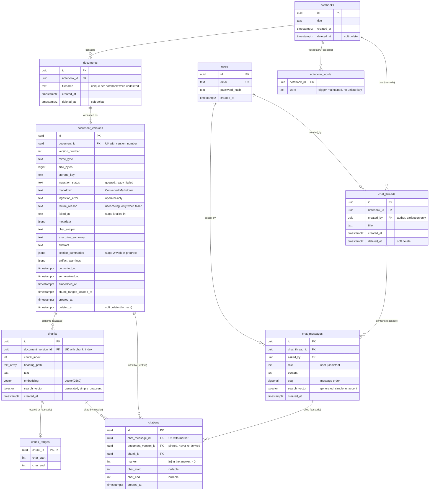

# Database schema

The application's Postgres schema as of migration `0020`, derived from
`apps/backend/src/db/migrations/`. There are no views. Not shown:
`schema_migrations` (the migration runner's bookkeeping, `src/db/migrate.ts`)
and the `pgboss` schema, which pg-boss owns and migrates itself.

## Notes the diagram can't carry

- **Triggers.** `AFTER INSERT` on `chunks` and on `chat_messages` adds the
  row's lexemes to `notebook_words` (`notebook_words_from_chunk`,
  `notebook_words_from_message` → `add_notebook_words`, filtered by
  `is_notebook_word`).
- **No ANN index on `chunks.embedding`.** Similarity search is an exact scan
  (ADR-0005).
- **Partial indexes on live rows.** `notebooks`, `documents`,
  `document_versions` and `chat_threads` index only `deleted_at IS NULL`.
- **Extensions.** `vector`, `unaccent`, `pg_trgm`, `btree_gin`, plus the
  `simple_unaccent` text search configuration.
